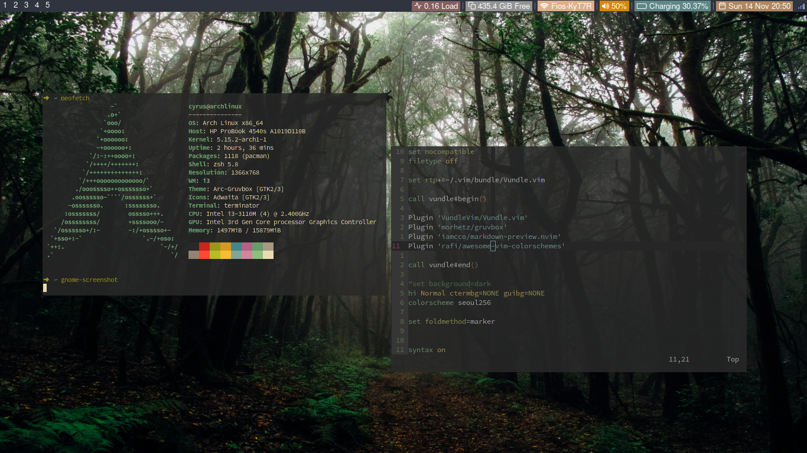

# Dotfiles

This is mainly for me for backup, its pretty minimal so it wouldn't be terribly
difficult to use this, but I am not particularly trying to make this a
user-friendly repo.

## vimrc

- Uses [vundle](https://github.com/VundleVim/Vundle.vim) for plugin manager.

## zshrc

- [oh-my-zsh](https://ohmyz.sh/)
- Uses [zsh-syntax-highlighting](https://github.com/zsh-users/zsh-syntax-highlighting)

## i3
- **Belongs in .config**
- This config of i3 requires the "System San Francisco" font (located in .fonts) 
	- [link to "System San Francisco"](https://github.com/supermarin/YosemiteSanFranciscoFont): Download the SSF font repo then put the \*.ttf files in ${HOME}/.fonts

### i3bar

The *i3/gen_config.sh* script is for applying a colorscheme to the colorbar. I
got these colorschemes from vim and just used this script to fill in the
colors.

Glyphs are from fontawesome

	$ sudo pacman -S ttf-font-awesome
